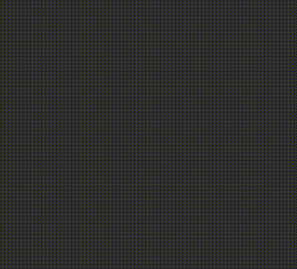

# Logo Animated

A smooth, elegant logo animation built with pure HTML, CSS, and SVG. Features customizable stroke animations and color theming through CSS variables.

## Live Demo

[View Live Demo](https://mtlogoanimated.netlify.app/)

## Screenshot



## Tech Stack

- **HTML5** - Semantic markup
- **CSS3** - Custom properties, animations, and keyframes
- **SVG** - Scalable vector graphics for logo rendering

## Features

- Pure CSS animations with no JavaScript dependencies
- Stroke drawing animation effect
- Customizable color palette via CSS variables
- Responsive design
- Smooth fill animations
- **Web Component** for easy integration into any website

## Usage

### Option 1: Web Component (Recommended)

The easiest way to use this logo on any website:

```html
<!-- Include the web component script -->
<script src="animated-logo.js"></script>

<!-- Use the component -->
<animated-logo></animated-logo>
```

#### Customization Options

You can customize the logo using HTML attributes:

**Size:**
```html
<animated-logo width="200" height="200"></animated-logo>
```

**Colors:**
```html
<animated-logo 
    letters-fill="#CC194D" 
    letters-stroke="#CC194D"
    globe-fill="#44A543"
    globe-stroke="#DEB72C">
</animated-logo>
```

**Animation Timing:**
```html
<animated-logo 
    letters-draw-duration="4s"
    letters-fill-duration="1s"
    globe-draw-delay="2.5s"
    globe-fill-delay="3s"
    globe-draw-duration="1s"
    globe-fill-duration="0.5s">
</animated-logo>
```

**All Available Attributes:**
- `width` - Logo width (default: 434)
- `height` - Logo height (default: 434)
- `letters-fill` - Fill color for letters (default: #FFFFFF)
- `letters-stroke` - Stroke color for letters (default: #FFFFFF)
- `globe-fill` - Fill color for globe (default: #1296E6)
- `globe-stroke` - Stroke color for globe (default: #FFFFFF)
- `letters-stroke-width` - Stroke width for letters (default: 6px)
- `globe-stroke-width` - Stroke width for globe (default: 12px)
- `letters-draw-delay` - Delay before letters start drawing (default: 0s)
- `letters-fill-delay` - Delay before letters fill (default: 1.125s)
- `globe-draw-delay` - Delay before globe starts drawing (default: 7.1s)
- `globe-fill-delay` - Delay before globe fills (default: 8.75s)
- `letters-draw-duration` - How long letters take to draw (default: 12s)
- `letters-fill-duration` - How long letters take to fill (default: 3.25s)
- `globe-draw-duration` - How long globe takes to draw (default: 2.75s)
- `globe-fill-duration` - How long globe takes to fill (default: 2s)

See `example.html` for live examples of all customization options.

### Option 2: Copy & Paste

Copy the styles and SVG markup directly from `index.html` into your webpage for full control over the implementation.

