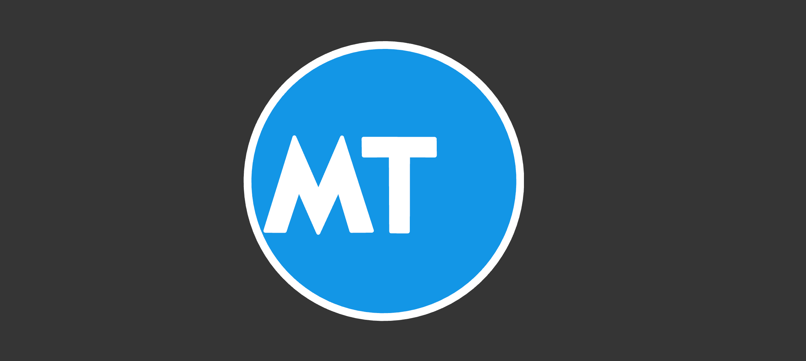

# Logo Animated

A smooth, elegant logo animation built with pure HTML, CSS, and SVG. Features customizable stroke animations and color theming through CSS variables.

## Live Demo

[View Live Demo](https://mtlogoanimated.netlify.app/)

## Screenshot

## Tech Stack

- **HTML5** - Semantic markup
- **CSS3** - Custom properties, animations, and keyframes
- **SVG** - Scalable vector graphics for logo rendering

## Features

- Pure CSS animations with no JavaScript dependencies
- Stroke drawing animation effect
- Customizable color palette via CSS variables
- Responsive design
- Smooth fill animations

